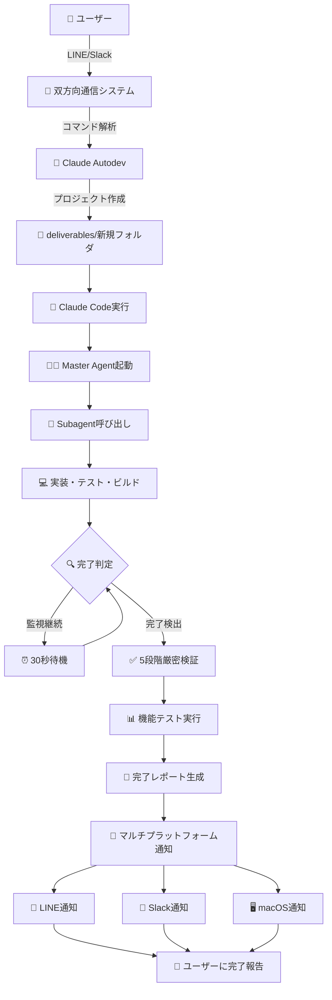

# Claude Autodev - 一晩セルフ完結開発システム

🤖 **Claude Code `/subagent` を使用した完全自動開発システム**

Claude Codeの`/subagent`機能を活用し、一晩で完全なプロジェクトを自動生成・完了まで管理するシステムです。マスター・チャイルドエージェント構造により、企画→実装→テスト→納品までの全工程を自動化します。

## 🌟 概要

### 🎯 **核心価値**
- **完全自動化**: 人間の介入なしに一晩でプロジェクト完成
- **確実な通知**: 複数プラットフォームでの冗長通知
- **品質保証**: 5段階厳密完了判定
- **双方向制御**: LINEからのリモートコマンド実行

### 📋 **現在管理中プロジェクト**
1. **AITec最新流行整理ツール** - Next.js + X API統合システム
2. **perfect-keiba-AI** - ベイジアン・モンテカルロ競馬予測AI
3. **claude-autodev** - 本自動開発システム

## 🏗️ システム構成

```
claude-autodev/
├── scripts/           # 🤖 自動化スクリプト群
│   ├── run_once.sh                   # 基本実行エンジン
│   ├── start_project.sh              # プロジェクト開始
│   ├── master_monitor.sh             # 完了監視システム
│   ├── check_project_completion.sh   # 5段階厳密完了判定
│   ├── validate_project_functionality.sh # 機能検証
│   ├── send_line_message.py          # LINE通知
│   ├── send_slack_message.py         # Slack通知
│   └── line_webhook_server.py        # 双方向通信サーバー
├── deliverables/      # 📁 完成プロジェクト格納庫 
│   ├── AITec最新流行整理ツール/
│   ├── perfect-keiba-AI/
│   └── {new-projects}/
├── prompts/           # 📝 エージェント指示テンプレート
├── logs/              # 📊 実行ログとレポート
├── config/            # ⚙️ 通知設定 (LINE/Slack)
└── ideas/             # 💡 プロジェクトアイデア保管
```

## 🚀 プロジェクト作成・編集方法

### 1. **新規プロジェクト作成**

#### コマンドライン実行
```bash
# 基本コマンド（推奨）
./scripts/start_project.sh "project-name" "project-description"

# 例: ReactのTODOアプリを作成
./scripts/start_project.sh "todo-app" "ReactでTODOアプリを作成。追加・削除・完了機能付き"

# アイデアファイルから開始（詳細な仕様がある場合）
./scripts/start_project_file.sh "project-name" "ideas/project.txt"
```

#### Slack経由での作成（リモート対応）
```bash
# スラッシュコマンド
/claude new weather-app "Next.jsで天気予報アプリを作成。OpenWeatherAPI使用"

# @メンション
@Claude Autodev claude new blog-system "WordPressライクなブログシステムをReact+Nodeで"

# ダイレクトメッセージ
claude new ecommerce-site "ECサイトをNext.js+Stripeで構築"
```

#### LINE経由での作成
```
/create ml-predictor Pythonで機械学習予測システムを構築
```

### 2. **プロジェクト編集・仕様変更**

#### Slack経由（推奨）
```bash
# 仕様変更
/claude modify todo-app "ダークモード機能を追加"
/claude modify weather-app "位置情報自動取得機能を追加"

# @メンション
@Claude Autodev claude modify blog-system "管理者権限とユーザー管理機能を追加"
```

#### LINE経由
```
/modify project-name 追加したい機能や変更内容
```

#### 直接編集（上級者向け）
```bash
# プロジェクトディレクトリで直接SPEC.mdを編集
cd deliverables/project-name
vim SPEC.md
git add SPEC.md
git commit -m "仕様変更: 新機能追加"
```

### 3. **プロジェクト管理・確認**

#### プロジェクト一覧確認
```bash
# Slack
/claude projects
claude status

# LINE
/list

# コマンドライン
ls deliverables/
```

#### プロジェクト詳細確認
```bash
# Slack（要約版）
/claude describe project-name
/claude describe claude-autodev  # システム自体の説明

# LINE
/describe project-name

# ToDo進捗確認（Slack）
/claude showToDo project-name     # 特定プロジェクト
/claude showToDo                  # 全プロジェクト

# コード複雑度分析（Slack）
/claude ccusage
```

### 4. **完了監視システム**
```bash
# バックグラウンド監視開始
./scripts/master_monitor.sh &
```

**自動化フロー:**
1. ✅ プロジェクト作成・実装（8段階最適化プロセス）
2. ✅ 5段階厳密完了判定
3. ✅ 自動GitHub統合（リポジトリ作成・PR生成）
4. ✅ マルチプラットフォーム通知（LINE・Slack・macOS）

**完了判定基準:**
1. ✅ 必須ファイル存在確認
2. ✅ 動作可能性検証
3. ✅ 依存関係解決
4. ✅ テスト実行成功
5. ✅ ビルド成功

### 3. **マルチプラットフォーム通信システム**

#### 📱 **LINE Bot (Webhook + Socket通信)**
- **双方向通信対応**: `/create`, `/modify`, `/list`, `/help`
- **通知システム**: プロジェクト完了時の自動通知
- **通信方式**: LINE Messaging API (Webhook)
- **実行サーバー**: `line_webhook_server.py` (Port 5001)

#### 💬 **Slack Bot (Socket Mode通信)**
- **双方向通信対応**: `claude new`, `claude modify`, `claude describe`, `claude projects`, `claude showToDo`, `claude ccusage`, `claude help`
- **通信方式**: Socket Mode (WebSocket接続、Request URL不要)
- **実行サーバー**: `slack_socket_server.py` (バックグラウンド)
- **対応形式**: 
  - @mention: `@Claude Autodev claude help`
  - DM: `claude describe claude-autodev`
  - スラッシュコマンド: `/claude showToDo project-name`

#### 🔔 **完了通知システム**
- **自動プロジェクト監視**: 30秒間隔での完了チェック
- **厳密完了判定**: 5段階検証 + 機能テスト
- **マルチチャンネル通知**: LINE + Slack + macOS同時送信
- **重複防止**: 完了済みプロジェクトの再通知回避
- **GitHub自動統合**: リポジトリ作成・PR生成・文書化

## ⚙️ 重要設定

### LINE Bot設定
```bash
# Webhook Server (双方向通信)
./scripts/line_webhook_server.py  # Port 5001

# ngrok tunnel (外部アクセス)
ngrok http 5001
```

### Slack Bot設定
```json
// config/slack_config.json (通知のみ)
{
  "webhook_url": "https://hooks.slack.com/services/...",
  "bot_name": "Claude Autodev Bot"
}

// config/slack_socket_config.json (Socket Mode双方向通信)
{
  "bot_token": "xoxb-...",
  "app_token": "xapp-...",
  "socket_mode": true,
  "commands": {
    "new": "claude new <project-name> <description>",
    "modify": "claude modify <project-name> <changes>",
    "describe": "claude describe <project-name>",
    "showToDo": "claude showToDo [project-name]",
    "ccusage": "claude ccusage",
    "projects": "claude projects",
    "help": "claude help"
  }
}
```

### Slack Socket Mode設定
```bash
# Socket Mode (WebSocket接続、Request URL不要)
export SLACK_BOT_TOKEN="YOUR_SLACK_BOT_TOKEN"
export SLACK_APP_TOKEN="YOUR_SLACK_APP_TOKEN"

# 仮想環境とサーバー起動
source slack_socket_env/bin/activate
python3 scripts/slack_socket_server.py  # バックグラウンド実行

# ⚠️ 重要: Socket ModeはRequest URL設定不要（WebSocket接続）
```

### プロジェクト完了判定
```bash
# 厳密完了チェック
./scripts/check_project_completion.sh "project-name"

# 機能検証
./scripts/validate_project_functionality.sh "project-name"
```

## 🔄 実行フロー

### プロジェクト作成〜完了通知までの完全自動化フロー



### 🔄 **通信フロー詳細**

#### 1. **受信 → 処理 → 送信**
```
LINE/Slack → Webhook/Socket → コマンド解析 → プロジェクト作成 → 実行開始通知
```

#### 2. **監視 → 検証 → 通知**
```
master_monitor.sh → 完了判定 → 機能検証 → 通知トリガー → マルチチャンネル送信
```

#### 3. **双方向制御コマンド完全一覧**

**プロジェクト作成・管理**
- `claude new project-name description` - 新規プロジェクト作成
- `claude modify project-name changes` - 仕様変更・機能追加
- `claude projects` / `claude status` - アクティブプロジェクト一覧

**プロジェクト情報確認**
- `claude describe project-name` - プロジェクト概要（要約版）
- `claude describe claude-autodev` - システム自体の説明
- `claude showToDo [project-name]` - ToDo進捗確認
- `claude ccusage` - コード複雑度分析レポート

**システム情報**
- `claude help` - 全コマンドヘルプ表示

**使用例**
```bash
# 新規プロジェクト作成
claude new weather-app "Next.jsで天気予報アプリ。OpenWeatherAPI使用"

# 機能追加
claude modify weather-app "位置情報自動取得とプッシュ通知機能を追加"

# 進捗確認
claude showToDo weather-app

# 全プロジェクト状況
claude projects
claude showToDo
```

## 📊 監視・ログ

### 重要ログファイル
- `logs/master_monitor.log` - 監視システムログ
- `logs/notifications.log` - 通知履歴
- `logs/line_messages.log` - LINE双方向通信ログ
- `logs/completed_projects.txt` - 完了プロジェクト一覧

### レポート自動生成
- `logs/reports/{project}_completion_report.md`
- プロジェクト概要・技術スタック・成果物まとめ

## 🛠️ システム運用コマンド

### 基本操作
```bash
# システム起動（必須）
./scripts/master_monitor.sh &

# 新規プロジェクト作成
./scripts/start_project.sh "app-name" "description"

# アイデアファイルからプロジェクト作成
./scripts/start_project_file.sh "app-name" "ideas/app-idea.txt"

# 通知テスト
./scripts/send_line_notification.sh "test-project"
python3 scripts/send_slack_message.py test
```

### GitHub統合テスト
```bash
# GitHub統合のテスト（プロジェクト完了後に自動実行）
./scripts/github_integration.sh "project-name" "deliverables/project-name"
```

### 双方向通信サーバー起動
```bash
# LINE双方向通信 (Port 5001)
python3 scripts/line_webhook_server.py &

# Slack Socket Mode通信 (WebSocket) - 最適化済み
source slack_socket_env/bin/activate
python3 scripts/slack_socket_server.py &

# ngrok tunnels  
ngrok http 5001  # LINE用のみ（Slack Socket ModeはWebSocket接続でngrok不要）
```

### 推奨ワークフロー
```bash
# 1. システム全体起動
./scripts/master_monitor.sh &                    # 完了監視
python3 scripts/line_webhook_server.py &        # LINE Bot
source slack_socket_env/bin/activate && python3 scripts/slack_socket_server.py &  # Slack Bot

# 2. プロジェクト作成（いずれかの方法）
# Slack: /claude new project-name "description"
# LINE: /create project-name description  
# CLI: ./scripts/start_project.sh "project-name" "description"

# 3. 自動完了まで待機（通知が来る）
# - macOS通知
# - LINE通知  
# - Slack通知
# - GitHub自動統合

# 4. 結果確認
# Slack: /claude describe project-name
# GitHub: 自動生成されたPRを確認
```

### メンテナンス
```bash
# ログクリア
rm -f logs/*.log

# 完了リストリセット
rm -f logs/completed_projects.txt

# 双方向通信サーバー再起動
pkill -f line_webhook_server
pkill -f slack_socket_server
python3 scripts/line_webhook_server.py &                 # Port 5001
source slack_socket_env/bin/activate && python3 scripts/slack_socket_server.py &  # Socket Mode
```

## 🔧 トラブルシューティング

### Slack通知が来ない場合
1. **監視プロセス確認**: `ps aux | grep master_monitor`
2. **ログ確認**: `tail -f logs/master_monitor.log`
3. **Slack設定確認**: 
   ```bash
   # 環境変数確認
   echo $SLACK_WEBHOOK_URL
   
   # 設定ファイル確認
   cat config/slack_config.json
   
   # テスト送信
   python3 scripts/send_slack_message.py test
   ```
4. **Slack Webhook URL更新**: `config/slack_config.json`を編集

### プロジェクト作成・編集方法
1. **Slack経由（推奨）**:
   - `/claude new project-name "description"`
   - `/claude modify project-name "changes"`
   
2. **LINE経由**:
   - `/create project-name description`
   - `/modify project-name changes`
   
3. **コマンドライン**:
   ```bash
   ./scripts/start_project.sh "project-name" "description"
   ./scripts/start_project_file.sh "project-name" "ideas/idea.txt"
   ```

### プロジェクトが完了しない
1. **完了判定確認**: `./scripts/check_project_completion.sh project-name`
2. **Claude Code権限**: `--dangerously-skip-permissions`フラグ確認
3. **手動完了マーク**: `echo "project-name" >> logs/completed_projects.txt`
4. **GitHub統合確認**: `gh auth status`でGitHub CLI認証確認

### 最適化された開発プロセス確認
```bash
# 使用中のテンプレート確認
cat prompts/master_builder_template.md

# 8段階プロセス（トークン最適化済み）
# 1. Planning & Architecture
# 2. Core Implementation  
# 3. Dependencies & Build
# 4. Comprehensive Testing
# 5. Code Review & QA
# 6. Build & Integration
# 7. Documentation & Release
# 8. Final Verification & GitHub
```

## 🚨 重要注意事項

1. **Git依存**: 唯一の外部依存関係
2. **Claude Code必須**: `/subagent`機能が核心
3. **8回制限**: トークン最適化のための制限（従来15回から削減）
4. **権限設定**: `--dangerously-skip-permissions`フラグ必要
5. **GitHub統合**: `gh` CLI必須（自動PR作成用）
6. **通知設定**: Slack WebhookとLINE Tokenの設定必要

## 📈 最新の最適化情報

### トークン使用量最適化
- **Subagent呼び出し**: 15回 → 8回 (47%削減)
- **品質保証**: テスト・ビルド・レビューフェーズ完全保持
- **GitHub統合**: 自動リポジトリ作成・PR生成
- **文書化**: `_docs/`での実装ログ自動生成

### 推奨使用方法
1. **Slack経由**でのプロジェクト作成・管理（最効率）
2. **LINE経由**でのリモート制御
3. **自動GitHub統合**による成果物管理
4. **マルチプラットフォーム通知**による完了確認

---

*🤖 Generated with Claude Code - Self-Contained Overnight Development System*
*⚡ Optimized 8-Subagent Workflow for Efficient Token Usage*
*🔄 Automatic GitHub Integration with PR Generation*