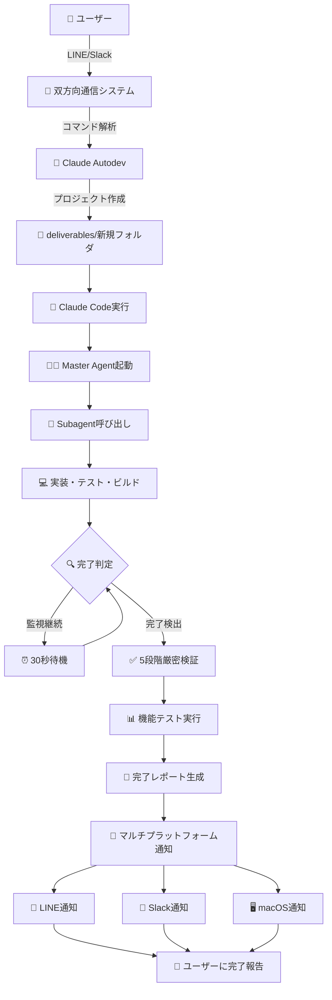

# Claude Autodev - 一晩セルフ完結開発システム

🤖 **Claude Code `/subagent` を使用した完全自動開発システム**

Claude Codeの`/subagent`機能を活用し、一晩で完全なプロジェクトを自動生成・完了まで管理するシステムです。マスター・チャイルドエージェント構造により、企画→実装→テスト→納品までの全工程を自動化します。

## 🌟 概要

### 🎯 **核心価値**
- **完全自動化**: 人間の介入なしに一晩でプロジェクト完成
- **確実な通知**: 複数プラットフォームでの冗長通知
- **品質保証**: 5段階厳密完了判定
- **双方向制御**: LINEからのリモートコマンド実行

### 📋 **現在管理中プロジェクト**
1. **AITec最新流行整理ツール** - Next.js + X API統合システム
2. **perfect-keiba-AI** - ベイジアン・モンテカルロ競馬予測AI
3. **claude-autodev** - 本自動開発システム

## 🏗️ システム構成

```
claude-autodev/
├── scripts/           # 🤖 自動化スクリプト群
│   ├── run_once.sh                   # 基本実行エンジン
│   ├── start_project.sh              # プロジェクト開始
│   ├── master_monitor.sh             # 完了監視システム
│   ├── check_project_completion.sh   # 5段階厳密完了判定
│   ├── validate_project_functionality.sh # 機能検証
│   ├── send_line_message.py          # LINE通知
│   ├── send_slack_message.py         # Slack通知
│   └── line_webhook_server.py        # 双方向通信サーバー
├── deliverables/      # 📁 完成プロジェクト格納庫 
│   ├── AITec最新流行整理ツール/
│   ├── perfect-keiba-AI/
│   └── {new-projects}/
├── prompts/           # 📝 エージェント指示テンプレート
├── logs/              # 📊 実行ログとレポート
├── config/            # ⚙️ 通知設定 (LINE/Slack)
└── ideas/             # 💡 プロジェクトアイデア保管
```

## 🚀 クリティカル機能

### 1. **自動プロジェクト実行**
```bash
# 新規プロジェクト開始
./scripts/start_project.sh "project-name" "project-description"

# アイデアファイルから開始
./scripts/start_project_file.sh "project-name" "ideas/project.txt"
```

### 2. **完了監視システム**
```bash
# バックグラウンド監視開始
./scripts/master_monitor.sh &
```

**5段階厳密完了判定:**
1. ✅ 必須ファイル存在確認
2. ✅ 動作可能性検証
3. ✅ 依存関係解決
4. ✅ テスト実行成功
5. ✅ ビルド成功

### 3. **マルチプラットフォーム通信システム**

#### 📱 **LINE Bot (Webhook + Socket通信)**
- **双方向通信対応**: `/create`, `/modify`, `/list`, `/help`
- **通知システム**: プロジェクト完了時の自動通知
- **通信方式**: LINE Messaging API (Webhook)
- **実行サーバー**: `line_webhook_server.py` (Port 5001)

#### 💬 **Slack Bot (Socket Mode通信)**
- **双方向通信対応**: `claude new`, `claude modify`, `claude projects`, `claude help`
- **通信方式**: Socket Mode (WebSocket接続、Request URL不要)
- **実行サーバー**: `slack_socket_server.py` (バックグラウンド)
- **対応形式**: 
  - @mention: `@Claude Autodev claude help`
  - DM: `claude new project-name description`
  - スラッシュコマンド: `/claude projects`

#### 🔔 **完了通知システム**
- **自動プロジェクト監視**: 30秒間隔での完了チェック
- **厳密完了判定**: 5段階検証 + 機能テスト
- **マルチチャンネル通知**: LINE + Slack + macOS同時送信
- **重複防止**: 完了済みプロジェクトの再通知回避

## ⚙️ 重要設定

### LINE Bot設定
```bash
# Webhook Server (双方向通信)
./scripts/line_webhook_server.py  # Port 5001

# ngrok tunnel (外部アクセス)
ngrok http 5001
```

### Slack Bot設定
```json
// config/slack_config.json (通知のみ)
{
  "webhook_url": "https://hooks.slack.com/services/...",
  "bot_name": "Claude Autodev Bot"
}

// config/slack_bidirectional_config.json (双方向通信)
{
  "bot_token": "xoxb-...",
  "signing_secret": "...",
  "commands": {
    "new": "claude new <project-name> <description>",
    "modify": "claude modify <project-name> <changes>",
    "projects": "claude projects",
    "help": "claude help"
  }
}
```

### Slack Socket Mode設定
```bash
# Socket Mode (WebSocket接続、Request URL不要)
export SLACK_BOT_TOKEN="YOUR_SLACK_BOT_TOKEN"
export SLACK_APP_TOKEN="YOUR_SLACK_APP_TOKEN"

# 仮想環境とサーバー起動
source slack_socket_env/bin/activate
python3 scripts/slack_socket_server.py  # バックグラウンド実行

# ⚠️ 重要: Socket ModeはRequest URL設定不要（WebSocket接続）
```

### プロジェクト完了判定
```bash
# 厳密完了チェック
./scripts/check_project_completion.sh "project-name"

# 機能検証
./scripts/validate_project_functionality.sh "project-name"
```

## 🔄 実行フロー

### プロジェクト作成〜完了通知までの完全自動化フロー



### 🔄 **通信フロー詳細**

#### 1. **受信 → 処理 → 送信**
```
LINE/Slack → Webhook/Socket → コマンド解析 → プロジェクト作成 → 実行開始通知
```

#### 2. **監視 → 検証 → 通知**
```
master_monitor.sh → 完了判定 → 機能検証 → 通知トリガー → マルチチャンネル送信
```

#### 3. **双方向制御コマンド**
- **プロジェクト作成**: `claude new todo-app Reactでタスク管理`
- **仕様変更**: `claude modify todo-app ダークモード追加`
- **進捗確認**: `claude projects`
- **ヘルプ**: `claude help`

## 📊 監視・ログ

### 重要ログファイル
- `logs/master_monitor.log` - 監視システムログ
- `logs/notifications.log` - 通知履歴
- `logs/line_messages.log` - LINE双方向通信ログ
- `logs/completed_projects.txt` - 完了プロジェクト一覧

### レポート自動生成
- `logs/reports/{project}_completion_report.md`
- プロジェクト概要・技術スタック・成果物まとめ

## 🛠️ 運用コマンド

### 基本操作
```bash
# システム起動
./scripts/master_monitor.sh &

# 新規プロジェクト
./scripts/start_project.sh "app-name" "description"

# 通知テスト
./scripts/send_line_notification.sh "test-project"
./scripts/send_slack_message.py test
```

### 双方向通信サーバー起動
```bash
# LINE双方向通信 (Port 5001)
python3 scripts/line_webhook_server.py &

# Slack Socket Mode通信 (WebSocket)
source slack_socket_env/bin/activate
python3 scripts/slack_socket_server.py &

# ngrok tunnels  
ngrok http 5001  # LINE用のみ（Slack Socket ModeはWebSocket接続でngrok不要）
```

### メンテナンス
```bash
# ログクリア
rm -f logs/*.log

# 完了リストリセット
rm -f logs/completed_projects.txt

# 双方向通信サーバー再起動
pkill -f line_webhook_server
pkill -f slack_socket_server
python3 scripts/line_webhook_server.py &                 # Port 5001
source slack_socket_env/bin/activate && python3 scripts/slack_socket_server.py &  # Socket Mode
```

## 🔧 トラブルシューティング

### 通知が来ない
1. `ps aux | grep master_monitor` で監視プロセス確認
2. `tail -f logs/master_monitor.log` でログ確認
3. 通知設定確認: `./scripts/send_line_notification.sh test`

### プロジェクトが完了しない
1. 完了判定基準確認: `./scripts/check_project_completion.sh project-name`
2. Claude Code実行権限: `--dangerously-skip-permissions`フラグ
3. 手動完了マーク: `echo "project-name" >> logs/completed_projects.txt`

## 🚨 重要注意事項

1. **Git依存**: 唯一の外部依存関係
2. **Claude Code必須**: `/subagent`機能が核心
3. **15回制限**: 無限ループ防止のための安全装置
4. **権限設定**: `--dangerously-skip-permissions`フラグ必要

---

*🤖 Generated with Claude Code - Self-Contained Overnight Development System*